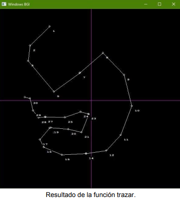

>*En este documento se explica el funcionamiento del proyecto “Trayectorias”, el      
>cual funciona con un programa en C++ que cuenta con un ambiente gráfico y una       
>librería desarrollada en C que realiza todo el procesamiento de los datos, basada  
>en el programa desarrollado por Miguel Eduardo Venegas Monroy en Matlab.*           

El objetivo de este proyecto es el desarrollo de un software que provea la capacidad  
de que un usuario pueda ingresar ciertos puntos en un plano (X,Y) por medio de una  
interfaz gráfica y, que por medio de unos cálculos de interpolación, te retorne   
la misma gráfica pero con curvas más suaves.

Este proyecto consta de dos partes:

● C++: La primera parte esta desarrollada en el lenguaje C++, es la encargada
de proveer   
la interfaz gráfica con la que el usuario interactúa. Donde esté
ingresa los datos y muestra los resultados.

● C: La segunda parte es desarrollada en el lenguaje C, esta es la encargada
de la realización  
de todos los cálculos que se requieren, Como lo son los
cálculos de la interpolación, primera y    
segunda derivada. Para mayor
practicidad esta parte se implementó como una librería .h para   
ser incluida en
la parte del programa en C++.

<table>

</table>

<table>

</table>

A continuación se hará una descripción de las funciones que componen este proyecto, por
parte      
 de la interfaz gráfica desarrollada en C++ y la librería desarrollada en C.

►Librería “interpolacion.h”   

La librería interpolación tiene como objetivo ser la que contenga las funciones que
realizan el procesamiento             
 de los datos de entrada que son los puntos o
coordenadas otorgados por el usuario, y de estos datos realizar               
 las operaciones para
calcular las derivadas y la interpolación de dichas coordenadas. Todo esto
desarrollado     
en el lenguaje C.

►Funciones elaboradas                     
Dentro de esta librería se encuentran 8 funciones donde 5 de ellas tienen
comunicación entre sí y se dividieron         
 en funciones para un mejor orden y
entendimiento. Las funciones son las siguientes:

● Interpolar

● mi_interpolacion

● derivada

● segundaderivada

● set_k

● fill_array

● printArrI

● printArrF

A continuación se describirán cada una de estas funciones                    

►Interpolar

Esta es la función principal del código ya que este es el que llama al resto de
funciones.        
Recibe once parámetros en los cuales 8 se almacenarán los resultados. Los
parámetros que recibe son     
 los siguientes:

● Vector X[ ]: Este vector contiene las coordenadas X ingresadas por el usuario.

● Vector Y[ ]: Este vector contiene las coordenadas Y ingresadas por el usuario.

● Vector dx[ ]: En este vector se almacenarán los resultados de la primera
derivada de X.

● Vector ddx[ ]: En este vector se almacenarán los resultados de la segunda
derivada de X.

● Vector dy[ ]: En este vector se almacenarán los resultados de la primera
derivada de Y.

● Vector ddy[ ]: En este vector se almacenarán los resultados de la segunda
derivada de Y.

● Vector int_x: En este vector se almacenarán los resultados de las
coordenadas de la interpolación en X.

● Vector int_y: En este vector se almacenarán los resultados de las
coordenadas de la interpolación en Y.

● Puntero size_x: En este puntero se guardará el valor de la longitud del vector
resultante de la interpolación en X (int_x).

● Puntero size_y: En este puntero se guardará el valor de la longitud del vector
resultante de la interpolación en Y (int_y).

● Entero punto: Esta variable entera indica el número de puntos que el usuario
marcó en el plano.

Dentro de esta función se llama a la función mi_interpolacion para realizar la
interpolación de “X” y “Y”         
llevándose los vectores necesarios y retornando el número
de datos que se utilizan.

<table>

</table>

Después, por motivos de seguridad, se realiza una condición donde se verifique que
los valores de tamaño  
 de datos a utilizar sea igual en x como en y, si son iguales, ya
se puede calcular los valores de K, si no,  
 despliega un mensaje.

 <table>
 

 
 

 </table>

►mi_interpolacion

<table>

</table>

En esta función se realiza la interpolación de las coordenadas de la ruta a tomar, así
como el cálculo de la    
primera y segunda derivada de los puntos. Esta función recibió
una modificación a comparación de la versión  
 anterior es el cambio de valor de una
variable dentro de uno de los ciclos. Este cambio se mostrara   
mas adelante.

Se reciben como parámetros:

● D[ ]: Este es el vector que contiene las coordenadas ya sea X o Y.

● puntos: El número de puntos o coordenadas que se envían.

● numero_des: Este ayuda para definir el incremento en la división o pedazos
por los que se analiza la gráfica.

Debido a que en C es difícil retornar un arreglo, se utilizó la ventaja de los punteros.
Esto se refiere a que referenciamos   
la ubicación de almacenamiento en memoria del
arreglo. de esta manera los cambios que se le hagan al arreglo   
dentro de la función
si lo afectarán sin la necesidad de realizar un retorno. En C al mandar un arreglo como parámetro  
 (int arr[ ]) ya estás indicando que es un puntero:

● aa[ ]: Este almacena los valores de la interpolación

● pd[ ]: Este arreglo almacena los valores de la primera derivada.

● sd[ ]: Aquí se almacenan los valores de la segunda derivada.

<table>

</table>

Después dentro de un ciclo se realiza el proceso de sacar la interpolación y las
derivadas del vector D[ ].

<table>

</table>

Al final de la función solamente se retorna el valor de j, donde este es un contador
para almacenar el número de datos almacenados en los arreglos y así saber el
tamaño de datos útiles.

►Modificación

Uno de los problemas que se tenía con la versión anterior era el tamaño que se
entregaba en los vectores,   
resultado de la interpolación y derivadas. Se realizó el
cambio en la inicialización de la variable b de 1 a 0;   
 Lo que nos entrega vectores más
grandes, permitiéndonos tener en el resultado final curvas más suaves.

<table>

</table>

-Derivada

Esta función realiza la primera derivada de la función. Los cambios hechos en el
traspaso de Matlab a C fueron casi nulos.

<table>

</table>

-Segunda derivada

De igual forma que en la función de la primera derivada, el cambio que se realizó fue
casi nulo quedando de la siguiente forma.

<table>

</table>

-set_K

En esta función se realiza el cálculo del vector K establecido en la función Interpolar
por motivos de que la función no se extendiera demasiado.

<table>

</table>

Recibiendo como parámetros las derivadas de (x,y), el tamaño de los vectores y el
puntero del vector K.

<table>

</table>

-fill_array

El objetivo de esta función es el de llenar un vector de forma sencilla Cuando se
requiere que sus valores sean incrementos de 1 en 1.  
Esta función recibe el vector, el inicio y el fin de los datos con los que se va a
rellenar.

<table>

</table>

-printArrI y printArrF

Estas dos funciones tienen el objetivo de imprimir los valores de un vector. la
diferencia es que una función imprime vectores con  
valores entero (int) y la otra de
valores flotantes (float),
Recibiendo como parámetros el vector y su tamaño.

<table>

</table>

<table>

</table>

►Desarrollo gráfico

Esta sección fue desarrollada para interactuar con el usuario, proveyendo una
interfaz gráfica para el ingreso y una mejor  
 visualización de los datos, desarrollado
en el lenguaje de C++ utilizando la librería graphics.h como herramienta para el  
desarrollo gráfico.

Dentro de esta parte gráfica se cuentan con las siguientes funciones:

● main  
● ginput  
● plano  
● trazar  
● trazar2

A continuación, se hará una descripción de cada una de estas funciones que forman
parte del proyecto en C++.

-main

Esta es la función que, como su nombre lo dice, es la principal del proyecto. Dentro
de esta se hacen los llamados de las  
 funciones realizadas en C++ y las
desarrolladas en C en la librería interpolacion.h.
En esta función se hace la inicialización   
de arreglos y variables que serán
necesarias en todo el proceso. Se utiliza una constante llamada MAX2, la cual tiene un  
 valor de 500; esto es para crear vectores grandes, ya que en C no se pueden crear
vectores con un tamaño dinámico.

<table>

</table>

Se crearon dos vectores de tipo entero con un tamaño de la constante MAXP para
contener las coordenadas X, Y que el usuario ingrese:

● X[MAXP]  
● Y[MAXP]

Se definen los arreglos que contienen los valores de las derivadas de la
interpolación:

● dx[MAX2]  
● ddx[MAX2]  
● dy[MAX2]  
● ddy[MAX2]   

Se definen también los arreglos resultado de la interpolación de la ruta “X” y “Y” .
Debido al problema de los vectores con  
 tamaño dinámico en C, se definen también
unas variables de tipo entero que indican el número de datos que almacena el
vector:

● int_x[MAX2]  
● int_y[MAX2]  
● size_x  
● size_y  

Dentro de la función (cuando comienza a funcionar después de realizar la creación
de las variables locales) se abre la  
 ventana gráfica con una dimensión de 600x600
pixeles.

<table>

</table>

Después se llama a la función plano para trazar los ejes del plano X, Y y se ingresan
los puntos con el ratón (mouse) en   
el plano por el usuario.

<table>

</table>

Después de haber ingresado los puntos se realiza la interpolación, haciendo el
llamado a la función Interpolar de la librería interpolacion .h

<table>

</table>

Una vez calculado esto dentro del programa, se tiene una función getch() para
generar una pausa antes de mostrar el   
resultado, por lo que se tendrá que presionar
cualquier tecla en el teclado para continuar y visualizar el resultado de la  
interpolación. Para esto se vuelve a trazar el plano y se llama a la función trazar2
para graficar el resultado.

<table>

</table>

Y por último, se cierra la ventana gráfica con la función closegraph() y termina el
programa.

►ginput

Esta función tiene como objetivo el guardar los puntos en el plano capturados por el
usuario, Almacenando estos valores   
en los vectores que recibe como parámetros X[
], Y[ ], con un límite de puntos definido por el parámetro num_points.

<table>

</table>

Dentro de esta función se utiliza un tipo de dato llamado POINT de la librería
graphics.h. Los objetos que son de este tipo   
son capaces de almacenar valores X y
Y. Utilizando la función GetCursorPos() obtenemos las coordenadas (x,y) de la  
posición del puntero (ratón) y las almacenamos en el objeto de tipo POINT.
Finalmente, con la función  
 GetAsyncKeyState(VK_LBUTTON), detectamos si ocurre
el evento en el que el usuario realiza click derecho con el ratón;   
para de esta forma
almacenar esas coordenadas en los vectores X, Y y se dibuja un punto en la
posición.

<table>

</table>

<table>

</table>

►plano

Esta es una función muy sencilla y tiene como único objetivo el trazar las líneas de
los ejes que marcan los cuadrantes en   
un plano (X,Y). Para trazar una línea se utilizan las funciones moveto() que se encarga de mover el origen del trazado de   
la línea y la función lineto() que dibuja la línea a la posición marcada.
Para trazar el eje Y se movió el origen a la mitad del  
 plano en el eje X y se trazó la
línea hasta el máximo del eje Y. Teniendo en cuenta que la pantalla es de 600x600
pixeles la,  
mitad es de 300 pixeles y el máximo es de 600 pixeles.

<table>

</table>

Para el eje X se usó la misma dinámica, pero al revés. Moviendo el origen a la mitad
del eje Y (300 pixeles) y trazando la línea  
 hasta el máximo del eje X (600 píxeles).

 <table>
 

 
 

 </table>

 <table>
 

 
 

 </table>

 <table>
 

 
 

 </table>

 ►trazar

 La función trazar fue creada para unir los puntos marcados por el usuario, y de esta
 forma poder visualizar la ruta  
  y el orden de una mejor manera; Recibiendo de
 parámetros los vectores con las coordenadas X, Y y el número de puntos.

 <table>
 

 
 

 </table>

 La función recibe las coordenadas y el número de puntos; y por medio de un ciclo va
 dibujando líneas del punto uno al   
 punto dos y así sucesivamente. Para una mejor
 visualización del orden se mostró el número del punto haciendo una   
 conversión de
 un número de entero (int) a una cadena (char) para poder imprimirlo en la pantalla de
 la siguiente manera:

 <table>
 

 
 

 </table>

 La función sprintf() guarda el valor de i en la variable n que es de tipo cadena (char)
 y con la función outtextxy() se  
  imprime en la pantalla gráfica en las coordenadas que
 le corresponde a ese punto, sumándole 10 pixeles para que no   
 se encima en el
 trazado de la línea.

 <table>
 

 
 

 </table>

 <table>
 

 
 

 </table>

►trazar2

El funcionamiento de la función trazar2() es igual al de trazar(). Recibiendo vectores
con las coordenadas X y Y, y el  
número de puntos que son. Pero en este caso
recibe vectores de tipo flotante que son el resultado de la interpolación.

<table>

</table>

En este caso la función solamente graficara los puntos sin marcar el número del
punto, ya que aquí crecen demasiado,  
 trazando las líneas de un punto al siguiente y
mostrando una gráfica con curvas más suaves.

<table>

</table>

<table>

</table>

►►Utilizar el proyecto

El proyecto consta de cuatro elementos:

1. Librería interpolacion.h: Contiene las funciones desarrolladas en C para los
cálculos de la interpolación y derivadas.

2. Archivo .cpp: Archivo que contiene el código en C++ con sus respectivas
funciones ya mencionadas.

3. Proyecto de Dev C++: El archivo principal que une el resto de archivos. Este
es el archivo que debe abrirse.

4. Layout: Este archivo guarda la configuración de diseño para el espacio de
trabajo del desarrollador, como qué archivos  
 estaban abiertos y dónde
estaban ubicados y usado para restaurar el diseño del área de trabajo para el
proyecto.

<table>

</table>

►►Problemas

►Tamaño de los vectores resultado:

Se analizó y comparo el tamaño de los vectores después de la modificación dentro de
la función mi_interpolacion; se puede   
ver que el resultado en C mejoro en
comparación a la versión anterior, pero sigue sin entregar vectores con el mismo  
tamaño de los de Matlab, entregando en C con 31 puntos en el plano vectores con
334 valores y en Matlab con 341 valores.

<table>

</table>

<table>

</table>

El tamaño de los vectores se cambió a 0, debido a que en Matlab los vectores inician en
1 y en C en 0. Por lo que al   
cambiarlo el ciclo tiene más interacciones, haciendo que
puedan ingresarse más valores, sin embargo el tamaño no  
 es el mismo.
Se revisó y comparo el número de repeticiones que realiza el primer ciclo
entregándonos un resultado  
 de 10 repeticiones en ambos programas (C y Matlab), por
lo que se procedió a analizar el número de repeticiones del  
 segundo ciclo y se encontró
que el número de repeticiones de este si varía entre ambos programas, entregándonos  
los siguientes resultados por iteración:

<table>

</table>

<table>

</table>

<table>

</table>

Se puede observar que en C se realiza una iteración menos en ciertas ocasiones y en
la última 2 menos. Por lo cual se  
 analizaron los datos del segundo ciclo.

 <table>
 

 
 

 </table>

Incremento real:

En esta variable el resultado es igual en ambos casos

Incremento real en C:

Incremento real en Matlab:

Valores de Z:

Los valores que toma el segundo ciclo en la función mi_interpolacion si presentan resultados
distintos, lo que hace que   
los resultados entre ambos programas varíen.

Como se puede ver los valores no son muy lejanos, pero a pesar de que en C la
variable z es del tipo flotante esta no  
 está tomando los valores decimales como lo
hace en Matlab, provocando un numero de iteraciones menor que en   
Matlab y que los
valores de las derivadas sean distintos, ya que estos dependen de los valores de Z.
